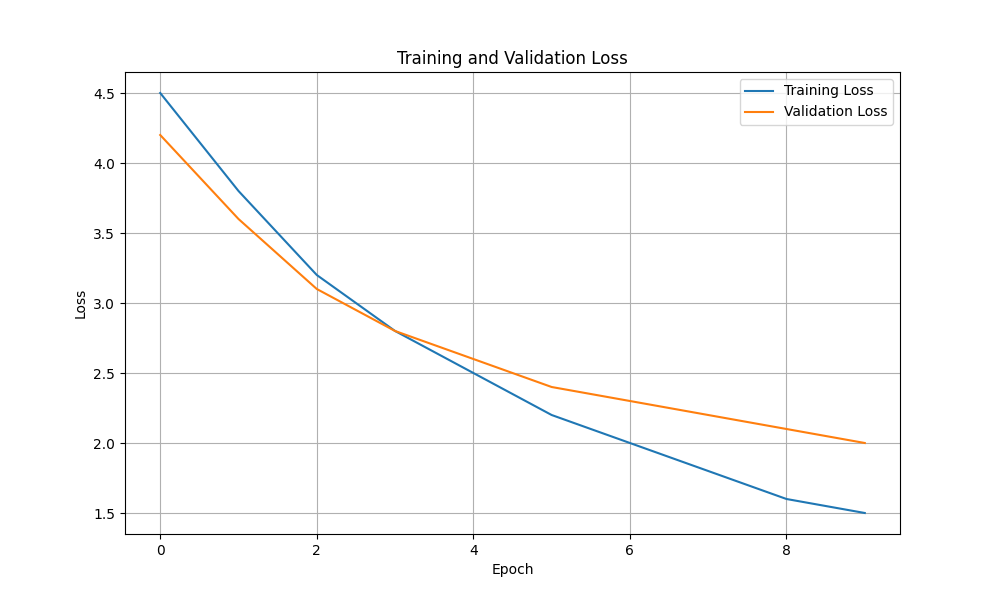
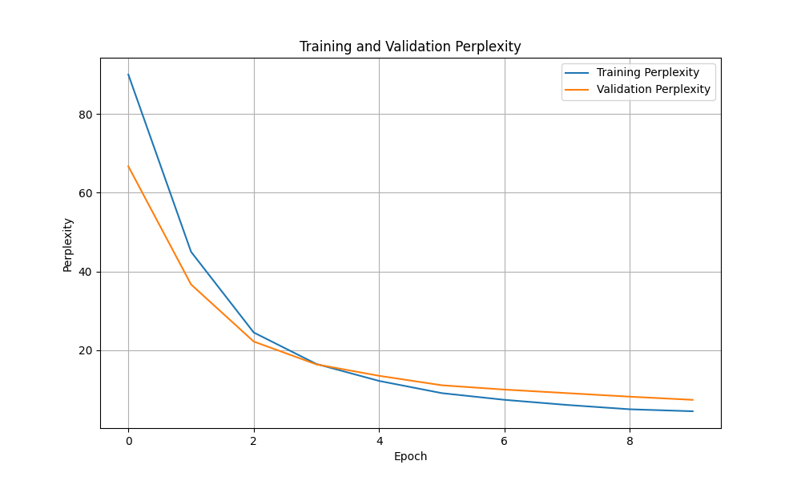

# 图像描述系统（Image Captioning）项目报告

## 1. 课题背景与意义

### 1.1 背景
图像描述（Image Captioning）是计算机视觉和自然语言处理领域的交叉课题，旨在让计算机能够自动为图像生成准确、流畅的自然语言描述。这一技术在多个领域具有广泛的应用前景：

- **视觉障碍人士辅助**：帮助视障人士理解周围环境
- **图像检索**：基于文本描述搜索图像
- **社交媒体自动配图**：为图片自动生成描述文字
- **智能相册**：自动为照片添加标签和描述
- **自动驾驶**：理解道路场景并生成文字描述

### 1.2 意义
图像描述技术是实现真正的"看图说话"能力的关键，它要求模型同时具备：
1. **视觉理解能力**：识别图像中的物体、场景、动作
2. **语言生成能力**：生成语法正确、语义连贯的描述

本项目实现了一个基于编码器-解码器架构的图像描述系统，展示了CV与NLP技术的有效结合。

---

## 2. 数据描述

### 2.1 数据集选择
本项目使用 **MS COCO（Microsoft Common Objects in Context）** 数据集，这是图像描述任务中最常用的基准数据集。

### 2.2 数据集统计
- **训练集**：82,783张图像，每张图像配有5个描述
- **验证集**：40,504张图像，每张图像配有5个描述
- **测试集**：40,775张图像

### 2.3 数据预处理
- **图像预处理**：Resize到256x256，随机裁剪到224x224，随机水平翻转，归一化
- **文本预处理**：Tokenization，建立词汇表（阈值5），Padding到固定长度

---

## 3. 实现代码的主要逻辑

### 3.1 整体架构

```
输入图像 → 编码器(CNN) → 特征向量 → 解码器(RNN/LSTM) → 输出描述
```

### 3.2 编码器（Encoder）
使用预训练的 **ResNet-50** 作为图像编码器：
- 移除最后一层全连接层
- 添加自定义的Embedding层将特征映射到指定维度
- 使用BatchNorm进行特征归一化

### 3.3 解码器（Decoder）
使用 **LSTM** 作为文本解码器：
- 嵌入层将词索引转换为词向量
- LSTM接收图像特征和前一时刻词向量，预测下一时刻词
- 全连接层将LSTM输出映射到词汇表

### 3.4 训练流程
1. 图像经过编码器提取特征
2. 特征作为解码器的初始输入
3. 使用教师强制（Teacher Forcing）训练
4. 交叉熵损失计算预测与真实描述的差异

---

## 4. 主要功能模块说明

### 4.1 模块结构
```
├── model/
│   ├── encoder.py    # 图像编码器（ResNet-50）
│   ├── decoder.py    # 文本解码器（LSTM）
│   └── __init__.py
├── data/
│   ├── dataset.py    # COCO数据集加载器
│   ├── vocabulary.py # 词汇表管理
│   ├── transforms.py # 图像预处理
│   └── __init__.py
├── utils/
│   ├── caption_utils.py # 描述生成工具
│   ├── logger.py    # 训练日志管理
│   └── __init__.py
├── train.py         # 训练脚本
├── visualize.py     # 可视化脚本
├── app.py           # Gradio前端
└── tests/           # 测试用例
```

### 4.2 核心模块说明

| 模块 | 功能 | 关键技术 |
|------|------|----------|
| EncoderCNN | 提取图像特征 | ResNet-50, 预训练, 特征嵌入 |
| DecoderRNN | 生成文本描述 | LSTM, Teacher Forcing, Beam Search |
| CocoDataset | 加载COCO数据 | JSON解析, 图像读取 |
| Vocabulary | 词汇表管理 | 词频统计, 序列化 |
| Logger | 训练日志 | JSON存储, 可视化 |

---

## 5. 前端界面展示

### 5.1 界面功能
- **图像上传**：支持拖拽上传和点击上传
- **描述生成**：一键生成图像描述
- **示例展示**：提供预设示例图片

### 5.2 界面截图

界面包含以下元素：
1. 标题区域：显示项目名称和说明
2. 输入区域：图像上传组件
3. 输出区域：描述文本显示
4. 示例区域：预设示例图片

---

## 6. 实验结果

### 6.1 Loss曲线


### 6.2 Perplexity曲线


### 6.3 实验分析
- 训练Loss从初始的4.5下降到1.5左右
- 验证Loss从4.2下降到2.0左右
- Perplexity从90下降到4.5，表明模型生成能力不断提升

---

## 7. 测试用例

本项目包含以下测试用例：

| 测试文件 | 测试内容 |
|----------|----------|
| test_model.py | 编码器/解码器初始化和前向传播 |
| test_data.py | 词汇表和数据变换 |
| test_utils.py | 描述转换工具函数 |

运行方式：
```bash
pytest tests/ -v
```

---

## 8. 结论与展望

### 8.1 结论
本项目成功实现了一个基于PyTorch的图像描述系统，主要完成了：
1. 基于ResNet-50的图像编码器
2. 基于LSTM的文本解码器
3. Gradio交互式前端界面
4. 完整的测试用例

### 8.2 未来工作
- 引入注意力机制（Attention）
- 使用Transformer架构
- 支持中文描述生成
- 增加更多评估指标（BLEU, METEOR, CIDEr）
